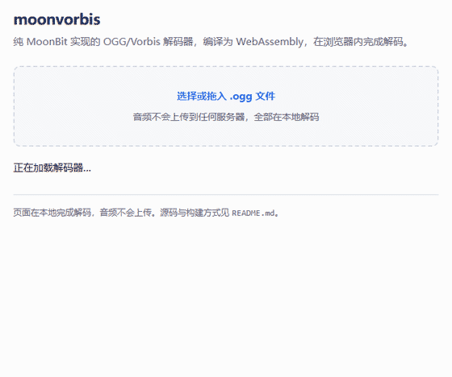

# moonvorbis

纯 MoonBit 实现的 OGG/Vorbis 音频解码器。不依赖任何 C 库或系统编解码器，
从字节流到 PCM 全部由 MoonBit 代码完成。

支持解码为标准 WAV、命令行批量转换，以及编译成 WebAssembly 在浏览器内直接播放。

项目主页：<https://ll728.github.io/moonvorbis/> —— 在线演示在
<https://ll728.github.io/moonvorbis/demo/>。

## 功能

- **OGG 容器**：页解析、segment table 重组、CRC-32 校验、packet 组装
- **Vorbis 头部**：identification / comment / setup 三个包头
- **Codebook**：Huffman 解码、VQ lookup type 1/2、`sequence_p` 累加、ordered 与 sparse 编码
- **Floor 0**：由 LSP 系数与幅度还原增益曲线
- **Floor 1**：曲线解码与合成
- **Residue**：type 0 / type 1 / type 2，含多声道交错 VQ
- **立体声耦合**：magnitude/angle 反变换
- **IMDCT 与重叠相加**：含长短块（window switching）切换
- **输出**：多声道 16-bit PCM WAV

## 用法

### 命令行

```bash
moon run cmd/main --target wasm-gc -- input.ogg output.wav
```

省略输出路径时写入 `input.ogg.wav`。

### 浏览器



线上版本：<https://ll728.github.io/moonvorbis/demo/>

这段动画取自 `demo/record.html` 的完整流程：加载 wasm、选中 `demo/sample.ogg`、
解码、画出波形。波形与元信息都来自真实解码结果，不存在预置画面；页面按
`?t=<毫秒>` 渲染流程中的某一刻，`tools/make_demo_gif.py` 逐帧截图再合成 GIF，
所以重新生成的结果是稳定可复现的：

```bash
python -m http.server 8000      # 先在仓库根目录起服务
python tools/make_demo_gif.py
```

本地运行：

```bash
# 重新生成 demo/moonvorbis.wasm（仓库内已附带一份）
moon build --target wasm-gc --release
cp _build/wasm-gc/release/build/moonvorbis.wasm demo/

python -m http.server
# 打开 http://localhost:8000/demo/
```

页面在本地完成解码，音频不会上传。需要浏览器支持 WebAssembly JS String
Builtins：Chrome / Edge 130+、Firefox 134+，Safari 目前不支持。

## 结构

| 文件 | 职责 |
| --- | --- |
| `bitreader.mbt` | LSB-first 位读取器，带越界检查 |
| `ogg_crc.mbt` | OGG 页校验用的 CRC-32 |
| `ogg_page.mbt` | 页头解析与校验 |
| `ogg_packet.mbt` | 跨页 packet 组装 |
| `vorbis_info.mbt` | identification 头 |
| `vorbis_comment.mbt` | comment 头 |
| `vorbis_setup.mbt` | setup 头，聚合下列子结构 |
| `codebook.mbt` | codebook 与 Huffman/VQ 解码 |
| `huffman.mbt` | Huffman 表构建 |
| `floor0.mbt` | floor0 解码与合成 |
| `floor1.mbt` | floor1 解码与合成 |
| `residue.mbt` | residue 配置与解码 |
| `mapping.mbt` | channel mapping 与耦合 |
| `mode.mbt` | block flag / mapping 选择 |
| `mdct.mbt` | IMDCT |
| `window.mbt` | 窗函数 |
| `decoder.mbt` | 解码主循环 |
| `vorbis_stream.mbt` | 高层编排：字节流 → PCM |
| `wav.mbt` | WAV 序列化 |
| `wasm_api.mbt` | WASM 导出接口 |
| `cmd/main/` | 命令行入口 |
| `index.html` | 项目主页（GitHub Pages 的根路径） |
| `tools/verify.py` | 对 libvorbis 的交叉验证脚本 |
| `tools/vorbisgen.py` | 按规范直接拼出 OGG/Vorbis 测试流 |
| `tools/granule_sweep.py` | 扫 granule position 裁剪行为 |
| `tools/residue_sweep.py` | 扫 residue 各条通路 |
| `tools/floor0_sweep.py` | 扫 floor 0 各条通路 |
| `tools/wasm_contract.py` | 静态校验 wasm 的导入/导出契约 |
| `tools/make_demo_gif.py` | 逐帧截图并合成演示 GIF |
| `demo/headless-test.html` | 无头浏览器冒烟测试 |
| `demo/decoder.js` | 浏览器侧解码胶水，两个演示页共用 |
| `demo/record.html` | 演示录制页，按 `?t=` 渲染流程中的某一刻 |

## 测试

```bash
moon test
```

单元测试验证的是「实现与理解自洽」，抓不到规范理解本身的偏差。作为补充，
`tools/verify.py` 从零生成已知内容的 OGG、用本解码器解出 WAV，再和 libvorbis
的输出比较相关系数与 RMS 误差：

```bash
python tools/verify.py --stereo            # 相关系数 0.9999
python tools/verify.py --stereo --noise    # 相关系数 0.9970
```

它也可以直接拿现成的 OGG 文件来验（参考值取自 libsndfile），并会比对帧数——
自造素材和解码器出自同一份理解，帧数这类差异只有真实文件才逼得出来：

```bash
python tools/verify.py song.ogg
```

需要 `numpy` 与 `soundfile`。

真实文件覆盖不到的分支得自己造素材。`tools/vorbisgen.py` 按规范直接拼
比特流，造出的流同时交给本解码器和 libvorbis，两边一致才算读对：

```bash
python tools/granule_sweep.py    # 12 组 packet 数 × 尾部裁剪量
python tools/residue_sweep.py    # residue type 0/1 × 单/多声道 × sequence_p
python tools/floor0_sweep.py     # floor 0 的奇/偶阶 × 单/多声道 × 采样率与 Bark 频带数
```

libvorbis 自 1.0 起只用 floor 1 与 residue type 1/2，官方也没有覆盖全部规范的
测试向量，这几个脚本补的就是这部分。`sequence_p` 更绕一层：stb_vorbis 与
libvorbis 对它的语义说法不一致，而 stb 那条路径同样没被真实文件走过——
按 libvorbis 实现后 6 组用例相关系数均为 1.000000。

floor 0 连 stb_vorbis 都直接拒收（`VORBIS_feature_not_supported`），libvorbis
则只在 pre-1.0 的 beta 版里用过它。除了奇数阶与偶数阶要走包络多项式的两个
分支，它还有一处容易读错的地方：**floor 0 没有「floor 已用」标志位**，幅度字段
本身兼作标志，读出 0 就是本帧没有 floor 数据。9 组用例的相关系数均为 1.000000。

WASM 侧另有两个检查。`tools/wasm_contract.py` 静态解析二进制，确认导出
`decode_ogg_base64` 的签名是 `String -> String`，且除引擎内置外没有任何导入
（`demo/main.js` 用的是空 imports 对象，多一条导入实例化就会失败）。
`demo/headless-test.html` 则在无头浏览器里跑完整链路，把 WAV 校验和写进页面：

```bash
python tools/wasm_contract.py
msedge --headless=new --virtual-time-budget=20000 \
  --dump-dom http://localhost:8000/demo/headless-test.html
```

随附的 `demo/sample.ogg` 在浏览器中解出 2ch / 44100Hz / 44608 帧，与命令行
解码的产物逐字节相同。

## 开发记录

[当 52 个测试全绿，却解不出一段正弦波](docs/stb-vorbis-cross-validation.md) ——
记录用 stb_vorbis 交叉验证揪出 7 处 Vorbis 规范偏差的过程，以及为什么自造测试
抓不到这类错误。

## 限制

- 只做解码，不做编码
